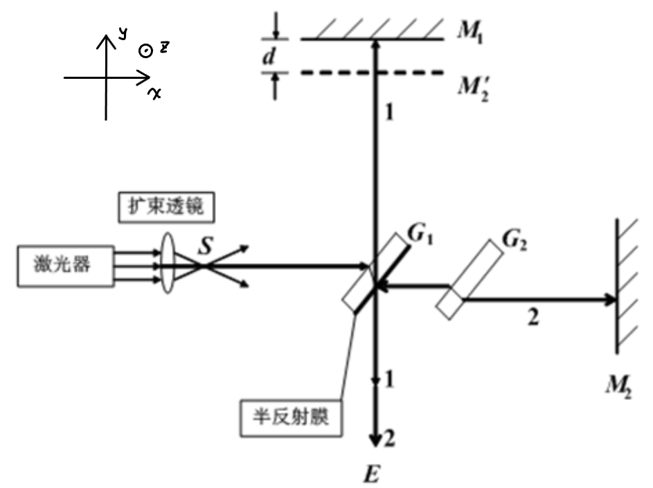

# Real Michelson - A Python-based Michelson Interferometer Simulator.

This is a python-based simulator for the Michelson interferometer.

Features:

- Support spectrum and colored pattern. 🌈
- Two interactive mode
  - GUI for monochromatic light source and simple operations.
  - Jupyter notebook (or cmd, or scripting) for complicated experiment parameters.

## Usage

### Device Setup

Our device setup is like this:

And you can control the central location and orientation of mirrors M1, M2, and the half mirror G. You can also add light sources with varied location, light spectrum and intensity.

### Examples

Jupyter notebook examples: `colored_examples.ipynb`. The notebook also includes illstrations for usage.

Run `visual.py` for the GUI program.

## Dependence

Main dependence: Python3, numpy, matplotlib, PyQt5.

## Acknowledgement

Codes to convert physical light spectrum to color is modified from [christian's blog post](https://scipython.com/blog/converting-a-spectrum-to-a-colour/).

And our GUI scipt is modified from [an example in matplotlib gallery](https://matplotlib.org/gallery/user_interfaces/embedding_in_qt5_sgskip.html). Copyright 2005 Florent Rougon, 2006 Darren Dale, 2015 Jens H Nielsen.

The discussion with [Prof. Zhaohui Zhang](http://faculty.pku.edu.cn/zhangchaohui/zh_CN/index.htm) also helps us improve the project.

Sincerely thank them all!
